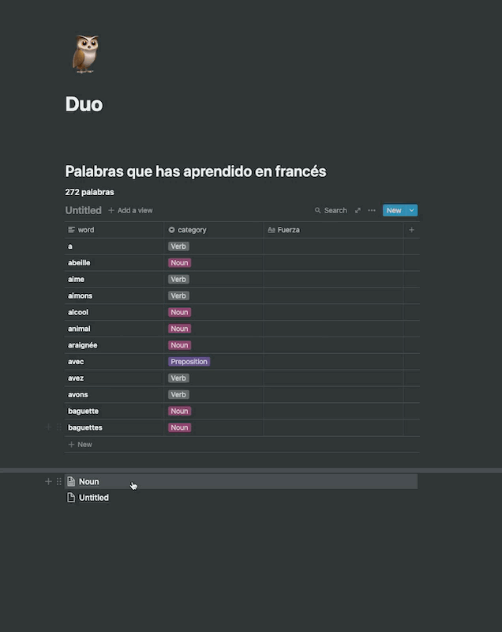
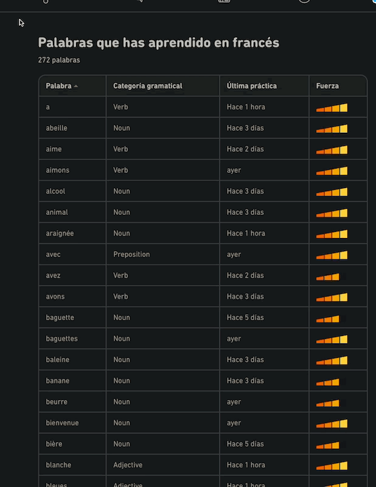

# Duoling words to AnkiApp

### Thanks to:
- https://github.com/jamalex/notion-py
- https://2anki.net/upload


### Demo




### Getting Started
1. Configuring the env variables
    ```dotenv
    GOOGLE_APPLICATION_CREDENTIALS=google-services.json
    NOTION_KEY=
    BASE_PAGE=
    TABLE_URL=
    ```

   - Obtain the `token_v2` value by inspecting your browser cookies on a logged-in (non-guest) session on Notion.so

2. Create a GCP project, enable Cloud Translate API, and generate a google-services.json. [Docs](https://cloud.google.com/translate/docs/reference/libraries/v3/python), finally copy the file in the root of the project
   - Remeber to change source and target languages in the method `translate_text`
3. Create a notion empty page, get the URL and set the env variable for `BASE_PAGE`
4. Go to https://www.duolingo.com/words and copy the table 
5. Copy the table into the notion page
6. rename columns to `word` and `category`
7. Get the table URL, and set the env variable for `TABLE_URL`
8. Run `main.py`
9. Import to ANKI
   - Export to HTML the page
   - Then use https://2anki.net/upload to generate your ANKI deck